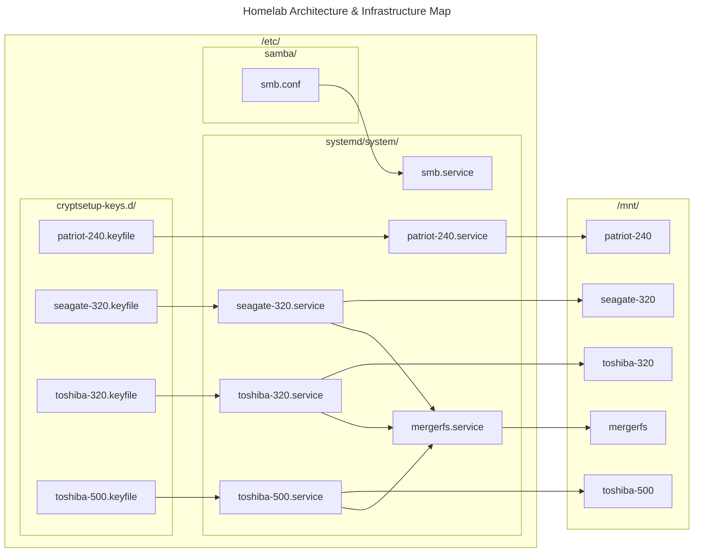

# Homelab

## Diagram


## TODO
- Move `fstab-entries-for-SMB-mounting-of-hard-disks` entries for SMB mounting of hard disks to Ansible
- Add rationale to README
- Add Proxmox section to README
- Implement a "pre-processing" stage for the pipeline to refactor constants such as IP addresses in a file and plug them in Terraform/Ansible
- ~~Learn Ansible and add setup for the server~~


## fstab
Change the virtual permissions on SMB mounts so we can read/write.
```
# SHARED
# mergerfs  patriot-240  seagate-320  toshiba-320  toshiba-500
//192.168.0.49/mnt/mergerfs /media/mergerfs cifs guest,uid=1000,gid=1001,dir_mode=0775,file_mode=0664,iocharset=utf8,_netdev,nofail,x-systemd.automount 0 0
//192.168.0.49/mnt/patriot-240 /media/patriot-240 cifs guest,uid=1000,gid=1001,dir_mode=0775,file_mode=0664,iocharset=utf8,_netdev,nofail,x-systemd.automount 0 0
//192.168.0.49/mnt/seagate-320 /media/seagate-320 cifs guest,uid=1000,gid=1001,dir_mode=0775,file_mode=0664,iocharset=utf8,_netdev,nofail,x-systemd.automount 0 0
//192.168.0.49/mnt/toshiba-320 /media/toshiba-320 cifs guest,uid=1000,gid=1001,dir_mode=0775,file_mode=0664,iocharset=utf8,_netdev,nofail,x-systemd.automount 0 0
//192.168.0.49/mnt/toshiba-500 /media/toshiba-500 cifs guest,uid=1000,gid=1001,dir_mode=0775,file_mode=0664,iocharset=utf8,_netdev,nofail,x-systemd.automount 0 0
```

