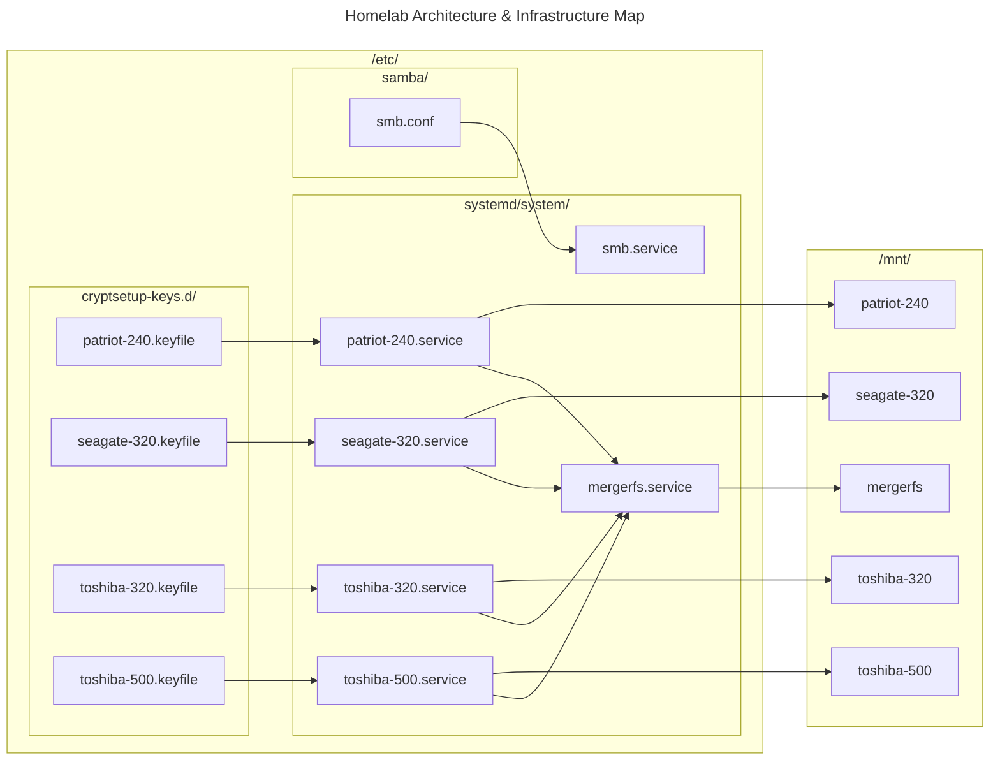

# Homelab

## Diagram


## TODO
- Move `fstab-entries-for-SMB-mounting-of-hard-disks` entries for SMB mounting of hard disks to Ansible
- Add rationale to README
- Add Proxmox section to README
- Implement a "pre-processing" stage for the pipeline to refactor constants such as IP addresses in a file and plug them in Terraform/Ansible
- ~~Learn Ansible and add setup for the server~~

## Disk layout
```
NAME                         MAJ:MIN RM   SIZE RO TYPE  MOUNTPOINTS
sda                            8:0    0 465.8G  0 disk  
├─sda1                         8:1    0  1007K  0 part  
├─sda2                         8:2    0     1G  0 part  /boot/efi
└─sda3                         8:3    0 464.8G  0 part  
  ├─pve-swap                 252:0    0   7.6G  0 lvm   [SWAP]
  ├─pve-root                 252:1    0    96G  0 lvm   /
  ├─pve-data_tmeta           252:2    0   3.4G  0 lvm   
  │ └─pve-data-tpool         252:4    0 338.2G  0 lvm   
  │   ├─pve-data             252:5    0 338.2G  1 lvm   
  │   ├─pve-vm--102--disk--0 252:9    0    16G  0 lvm   
  │   └─pve-vm--103--disk--0 252:11   0     8G  0 lvm   
  └─pve-data_tdata           252:3    0 338.2G  0 lvm   
    └─pve-data-tpool         252:4    0 338.2G  0 lvm   
      ├─pve-data             252:5    0 338.2G  1 lvm   
      ├─pve-vm--102--disk--0 252:9    0    16G  0 lvm   
      └─pve-vm--103--disk--0 252:11   0     8G  0 lvm   
sdb                            8:16   0 223.6G  0 disk  
└─patriot-240-mapper         252:6    0 223.6G  0 crypt /mnt/patriot-240
sdc                            8:32   0 298.1G  0 disk  
└─toshiba-320-mapper         252:10   0 298.1G  0 crypt /mnt/toshiba-320
sdd                            8:48   0 298.1G  0 disk  
└─seagate-320-mapper         252:7    0 298.1G  0 crypt /mnt/seagate-320
sde                            8:64   0 465.8G  0 disk  
└─toshiba-500-mapper         252:8    0 465.7G  0 crypt /mnt/toshiba-500
sr0                           11:0    1  1024M  0 rom
```

## fstab entries for SMB mounting of hard disks
Note that we need to create the respective users and add them to the media group.
```
ubuntu@ubuntu:~$ sudo adduser *arr
ubuntu@ubuntu:~$ sudo addgroup media
ubuntu@ubuntu:~$ sudo usermod -aG media *arr
ubuntu@ubuntu:~$ getent group media
media:x:1001:sonarr,radarr,bazarr,lidarr
```

Also, we need to change the virtual permissions on SMB mounts so we can read/write.
```
# SHARED
# mergerfs  patriot-240  seagate-320  toshiba-320  toshiba-500
//192.168.0.49/mnt/mergerfs /media/mergerfs cifs guest,uid=1000,gid=1001,dir_mode=0775,file_mode=0664,iocharset=utf8,_netdev,nofail,x-systemd.automount 0 0
//192.168.0.49/mnt/patriot-240 /media/patriot-240 cifs guest,uid=1000,gid=1001,dir_mode=0775,file_mode=0664,iocharset=utf8,_netdev,nofail,x-systemd.automount 0 0
//192.168.0.49/mnt/seagate-320 /media/seagate-320 cifs guest,uid=1000,gid=1001,dir_mode=0775,file_mode=0664,iocharset=utf8,_netdev,nofail,x-systemd.automount 0 0
//192.168.0.49/mnt/toshiba-320 /media/toshiba-320 cifs guest,uid=1000,gid=1001,dir_mode=0775,file_mode=0664,iocharset=utf8,_netdev,nofail,x-systemd.automount 0 0
//192.168.0.49/mnt/toshiba-500 /media/toshiba-500 cifs guest,uid=1000,gid=1001,dir_mode=0775,file_mode=0664,iocharset=utf8,_netdev,nofail,x-systemd.automount 0 0
```

