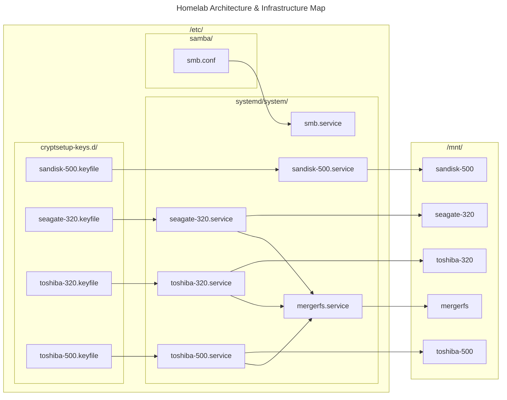

# Homelab

## Software

## Hardware
- Processors: 4 x Intel® Core™* 15-6600 CPU @ 3.30GHz
- Memory: 8 GIB of RAM (7.6 GiB usable)
- Graphics Processor: Mesa Intel® HD Graphics 530
- Manufacturer: Dell Inc.
- Product Name: OptiPlex 5050

## Disks Diagram

## TODO
- Add rationale to README
- Use ssot
- ~~Learn Ansible and add setup for the server~~
